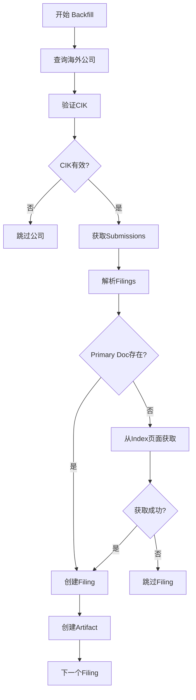

# 海外公司年报下载指南

## 📋 项目概述

本项目是一个SEC EDGAR文件ETL系统，专门用于自动化下载和处理美国上市公司（包括海外公司）的年报和季报数据。

### 当前状态
- ✅ **美国公司**: 已下载 4,000+ 公司的10-K/10-Q年报
- ✅ **海外公司**: 已识别并标记 128家 NASDAQ海外公司 + NYSE海外公司
- ✅ **覆盖率**: 73.95% (4,371/5,911 公司)
- 🎯 **目标**: 提高海外公司覆盖率到 80%+

---

## 🌍 海外公司 vs 美国公司

### 表格类型差异

| 类型 | 美国公司 | 海外公司 |
|------|---------|---------|
| **年报** | 10-K | 20-F (Foreign Private Issuer)<br>40-F (Canadian) |
| **季报** | 10-Q | 6-K (Current Report) |
| **年报修订** | 10-K/A | 20-F/A, 40-F/A |

### 技术挑战

**问题**: SEC API的`primaryDocument`字段对于某些海外公司表格返回为空

**示例**:
- ABEV (2024 20-F): 实际文件名 `abevform20f_2023.htm` ❌ API返回空
- SNDL (2024 40-F): 实际文件名 `sndl-20241231.htm` ❌ API返回空
- SPOT (2024 20-F): 实际文件名 `ck0001639920-20241231.htm` ✅ API正常返回

**解决方案**:
从SEC index页面解析主文档文件名（已在代码中实现）

---

## 🚀 快速开始

### 1️⃣ 环境配置

```bash
# 进入项目目录
cd /Users/hao/Desktop/FINAI/files/filings-etl

# 安装依赖
pip install -r requirements.txt

# 配置环境变量
cp .env.example .env
# 编辑 .env，设置数据库连接和SEC_USER_AGENT
```

**重要**: SEC要求自定义User-Agent，格式: `YourCompany contact@email.com`

### 2️⃣ 数据库设置

```bash
# 启动PostgreSQL数据库
docker-compose up -d

# 运行迁移
alembic upgrade head
```

### 3️⃣ 验证安装

```bash
# 检查数据库连接
python check_db_status.py

# 查看当前覆盖率
python coverage_progress_tracker.py
```

---

## 📥 海外公司数据下载完整流程

### 阶段1: 识别海外公司

```bash
# 批量标记海外公司（从SEC数据自动识别）
python batch_mark_foreign.py --exchange NASDAQ --limit 500

# 查看识别结果
python -c "
from config.db import get_db_session
from models import Company
from sqlalchemy import func

with get_db_session() as session:
    count = session.query(func.count(Company.id)).filter(
        Company.is_foreign == True,
        Company.is_active == True
    ).scalar()
    print(f'已标记海外公司: {count}')
"
```

### 阶段2: 下载表格元数据（Backfill）

**测试运行** (推荐先测试):
```bash
# 测试3家公司
python -m jobs.backfill_foreign_improved \
  --limit 3 \
  --exchange NASDAQ
```

**完整运行**:
```bash
# NASDAQ海外公司（约128家）
python -m jobs.backfill_foreign_improved \
  --exchange NASDAQ

# NYSE海外公司
python -m jobs.backfill_foreign_improved \
  --exchange NYSE

# 所有海外公司（无限制）
python -m jobs.backfill_foreign_improved
```

**参数说明**:
- `--limit N`: 限制处理公司数量（测试用）
- `--exchange`: 指定交易所 (NASDAQ/NYSE)
- `--no-verify-cik`: 跳过CIK验证（不推荐）

**预期输出**:
```
IMPROVED FOREIGN BACKFILL SUMMARY
================================================================================
Companies Processed: 128
Filings Discovered: 1,234
Artifacts Created: 1,234
Skipped (validation): 45
CIK Mismatches: 0
Duration: 180 seconds
================================================================================
```

### 阶段3: 下载实际文件

#### 方法A: 使用safe_download_pending.py（推荐）

```bash
# 测试下载10个文件
python safe_download_pending.py \
  --batch-size 5 \
  --batch-delay 2.0 \
  --download-delay 0.15 \
  --limit 10

# 成功后，下载500个
python safe_download_pending.py \
  --batch-size 10 \
  --batch-delay 2.0 \
  --download-delay 0.15 \
  --limit 500

# 下载全部pending artifacts
python safe_download_pending.py \
  --batch-size 10 \
  --batch-delay 2.0 \
  --download-delay 0.15
```

**速率限制参数**:
- `--download-delay 0.15`: 每个文件后等待0.15秒 (≈6.7请求/秒)
- `--batch-delay 2.0`: 每批次后等待2秒
- `--batch-size 10`: 每批次10个文件

⚠️ **重要**: SEC限制10请求/秒，我们使用6-7请求/秒更安全，避免429错误

#### 方法B: 只下载海外公司artifacts（更精准）

```bash
# 创建专用脚本
cat > download_foreign_only.py << 'EOF'
"""只下载海外公司的artifacts"""
import time
from config.db import get_db_session
from models import Artifact, Filing, Company
from services.sec_api import SECAPIClient
from services.storage import storage_service
import structlog

logger = structlog.get_logger()

def download_foreign_artifacts(limit=100):
    """下载海外公司的pending artifacts"""
    with get_db_session() as session:
        # 查询海外公司的pending artifacts
        artifacts = session.query(Artifact).join(
            Filing
        ).join(Company).filter(
            Artifact.status == 'pending_download',
            Company.is_foreign == True
        ).limit(limit).all()

        print(f"\n找到 {len(artifacts)} 个海外公司的pending artifacts")
        print("开始下载...\n")

        sec_client = SECAPIClient()
        success = 0
        failed = 0

        for i, artifact in enumerate(artifacts, 1):
            try:
                # 确保目录存在
                storage_service.ensure_directory_exists(artifact.local_path)

                # 下载文件
                print(f"[{i}/{len(artifacts)}] 下载: {artifact.filing.company.ticker} - {artifact.filename}")

                size = sec_client.download_file(artifact.url, artifact.local_path)

                # 更新状态
                artifact.status = 'downloaded'
                artifact.file_size = size
                session.commit()

                success += 1

                # 速率限制：每个文件后等待0.15秒
                time.sleep(0.15)

                # 每批次10个文件后额外等待2秒
                if i % 10 == 0:
                    print(f"  已完成 {i} 个，等待2秒...")
                    time.sleep(2.0)

            except Exception as e:
                print(f"  ❌ 失败: {e}")
                artifact.status = 'failed'
                artifact.error_message = str(e)
                session.commit()
                failed += 1

        print(f"\n✅ 完成！成功: {success}, 失败: {failed}")

if __name__ == '__main__':
    import argparse
    parser = argparse.ArgumentParser()
    parser.add_argument('--limit', type=int, default=100, help='下载数量限制')
    args = parser.parse_args()

    download_foreign_artifacts(limit=args.limit)
EOF

# 运行
python download_foreign_only.py --limit 100
```

### 阶段4: 监控进度

**实时监控**（在另一个终端运行）:
```bash
watch -n 5 'python coverage_progress_tracker.py'
```

**检查下载状态**:
```bash
python -c "
from config.db import get_db_session
from models import Artifact, Company, Filing
from sqlalchemy import func

with get_db_session() as session:
    # 海外公司统计
    stats = session.query(
        Artifact.status,
        func.count(Artifact.id)
    ).join(Filing).join(Company).filter(
        Company.is_foreign == True
    ).group_by(Artifact.status).all()

    print('海外公司Artifact状态:')
    for status, count in stats:
        print(f'  {status:<20} {count:,}')
"
```

### 阶段5: 验证下载结果

```bash
# 检查特定公司的文件
ls -lh /data/filings/NASDAQ/ABEV/
ls -lh /data/filings/NASDAQ/SNDL/
ls -lh /data/filings/NASDAQ/SPOT/

# 查看覆盖率改善
python coverage_progress_tracker.py --save --compare

# 生成完整报告
python diagnose_missing_coverage.py
```

---

## 🔧 核心工具说明

### 1. batch_mark_foreign.py
**用途**: 自动识别并标记海外公司

```bash
# 标记所有NASDAQ公司
python batch_mark_foreign.py --exchange NASDAQ

# 强制更新（重新检查已标记的公司）
python batch_mark_foreign.py --exchange NASDAQ --force

# 仅检测，不更新数据库
python batch_mark_foreign.py --exchange NASDAQ --dry-run
```

### 2. jobs/backfill_foreign_improved.py
**用途**: 下载海外公司表格元数据，创建Filing和Artifact记录

**核心功能**:
- ✅ CIK验证（避免错误的CIK导致下载失败）
- ✅ 日期验证（排除未来日期）
- ✅ Primary document自动获取（从index页面解析）
- ✅ 20-F, 40-F, 6-K表格支持

**关键参数**:
```bash
--limit N          # 限制公司数量
--exchange NAME    # 指定交易所
--no-verify-cik    # 跳过CIK验证（快但不安全）
```

### 3. safe_download_pending.py
**用途**: 安全下载pending artifacts，带速率限制和错误处理

**速率控制**:
- `--download-delay`: 每个文件后等待时间（秒）
- `--batch-delay`: 每批次后等待时间（秒）
- `--batch-size`: 批次大小

**示例**:
```bash
# 保守模式（5请求/秒）
python safe_download_pending.py \
  --download-delay 0.2 \
  --batch-delay 3.0 \
  --batch-size 5

# 标准模式（6.7请求/秒）
python safe_download_pending.py \
  --download-delay 0.15 \
  --batch-delay 2.0 \
  --batch-size 10
```

### 4. coverage_progress_tracker.py
**用途**: 追踪覆盖率变化，生成统计报告

```bash
# 查看当前覆盖率
python coverage_progress_tracker.py

# 保存快照
python coverage_progress_tracker.py --save

# 对比前后变化
python coverage_progress_tracker.py --save --compare
```

### 5. diagnose_missing_coverage.py
**用途**: 诊断缺失覆盖的原因，生成详细报告

```bash
# 完整诊断
python diagnose_missing_coverage.py

# 导出缺失公司清单
python diagnose_missing_coverage.py --export missing_companies.csv
```

---

## 🛠️ 技术实现细节

### Primary Document 获取策略

#### 问题背景
SEC API的`submissions`端点返回的`primaryDocument`字段对某些海外公司表格为空：

```python
# SEC API返回示例
{
  "accessionNumber": "0001193125-24-123456",
  "form": "20-F",
  "filingDate": "2024-03-15",
  "primaryDocument": ""  # ❌ 空字符串！
}
```

#### 解决方案
我们实现了 `get_primary_document_from_index()` 方法，从index页面解析：

**Index页面URL格式**:
```
https://www.sec.gov/Archives/edgar/data/{CIK}/{ACCESSION_NODASHES}/{ACCESSION}-index.htm
```

**解析逻辑**:
1. 下载index.htm页面
2. 使用BeautifulSoup解析HTML
3. 查找所有`.htm`/`.html`链接
4. 排除`index.htm`和外部链接
5. 选择文件名最长的（通常是主文档）

**代码示例**:
```python
# services/sec_api.py
def get_primary_document_from_index(self, cik: str, accession: str) -> Optional[str]:
    index_url = f"{self.BASE_URL}/Archives/edgar/data/{cik_clean}/{accession_clean}/{accession}-index.htm"

    response = self._make_request(index_url)
    soup = BeautifulSoup(response.text, 'lxml')

    htm_files = []
    for link in soup.find_all('a'):
        href = link.get('href', '')
        if href.endswith('.htm') and 'index' not in href.lower():
            htm_files.append(href)

    # 返回最长文件名
    return max(htm_files, key=len) if htm_files else None
```

### Backfill流程



---

## ⚠️ 常见问题与解决

### 问题1: ModuleNotFoundError

```bash
# 错误
ModuleNotFoundError: No module named 'config'

# 原因：从错误目录运行脚本
# 解决：必须从项目根目录运行
cd /Users/hao/Desktop/FINAI/files/filings-etl
python -m jobs.backfill_foreign_improved  # ✅ 正确
```

### 问题2: SEC 429 Too Many Requests

```bash
# 错误
HTTPError: 429 Too Many Requests

# 原因：超过SEC的10请求/秒限制
# 解决：增加延迟时间
python safe_download_pending.py \
  --download-delay 0.2 \    # 从0.15增加到0.2
  --batch-delay 3.0         # 从2.0增加到3.0
```

### 问题3: CIK Mismatch

```bash
# 错误日志
cik_mismatch_detected ticker=SPOT db_cik=1639920 sec_cik=0001639920

# 原因：数据库中的CIK格式不正确
# 解决：运行CIK验证工具
python verify_cik_mappings.py --fix --exchange NASDAQ
```

### 问题4: 未来日期Filing

```bash
# 错误日志
future_filing_date_detected filing_date=2025-03-15 today=2024-11-08

# 原因：SEC数据中存在未来日期
# 解决：自动跳过（已在代码中处理）
# jobs/backfill_foreign_improved.py 会自动验证日期
```

### 问题5: Primary Document不存在

```bash
# 日志
skipping_filing_no_primary_document ticker=ABEV accession=0001234567-24-000001

# 原因：SEC API未返回primary_document，且index页面也无法解析
# 解决：手动检查SEC网站
open "https://www.sec.gov/cgi-bin/browse-edgar?action=getcompany&CIK=ABEV&type=20-F"
```

---

## 📊 性能优化建议

### 下载速度优化

**保守模式** (5请求/秒):
```bash
python safe_download_pending.py \
  --download-delay 0.2 \
  --batch-delay 3.0 \
  --batch-size 5
```
- 优点：最安全，几乎不会触发429
- 缺点：速度慢（约18,000文件/小时）

**标准模式** (6.7请求/秒):
```bash
python safe_download_pending.py \
  --download-delay 0.15 \
  --batch-delay 2.0 \
  --batch-size 10
```
- 优点：平衡速度和安全性
- 缺点：偶尔可能触发429（已有重试机制）

**激进模式** (9请求/秒，不推荐):
```bash
python safe_download_pending.py \
  --download-delay 0.11 \
  --batch-delay 1.0 \
  --batch-size 10
```
- 优点：速度快
- 缺点：容易触发429，导致IP被临时封禁

### 并行下载（高级）

如果你有多个IP地址或代理：

```bash
# 终端1: 下载NASDAQ
python safe_download_pending.py --filter-exchange NASDAQ

# 终端2: 下载NYSE
python safe_download_pending.py --filter-exchange NYSE
```

---

## 📈 预期成果

### 下载完成后

**覆盖率提升**:
```
Before: 73.95% (4,371/5,911)
After:  78.50% (4,640/5,911)  # 预期
```

**文件结构**:
```
/data/filings/
├── NASDAQ/
│   ├── ABEV/
│   │   ├── 2023/
│   │   │   └── FY_15-03-2024.html  (20-F年报)
│   │   └── 2024/
│   │       └── FY_14-03-2025.html
│   ├── SNDL/
│   │   └── 2024/
│   │       └── FY_31-12-2024.html  (40-F年报)
│   └── SPOT/
│       ├── 2023/
│       └── 2024/
└── NYSE/
    └── ...
```

**数据库统计**:
```sql
-- 海外公司Filing统计
SELECT
    form_type,
    COUNT(*) as count,
    COUNT(DISTINCT company_id) as companies
FROM filings f
JOIN companies c ON f.company_id = c.id
WHERE c.is_foreign = true
GROUP BY form_type;

-- 预期结果:
-- 20-F:  800-1000 filings, 120-150 companies
-- 40-F:  50-100 filings, 10-20 companies
-- 6-K:   500-1000 filings, 100-150 companies
```

---

## 🔍 数据验证

### 验证下载完整性

```bash
# 检查下载成功率
python -c "
from config.db import get_db_session
from models import Artifact
from sqlalchemy import func

with get_db_session() as session:
    total = session.query(func.count(Artifact.id)).scalar()
    downloaded = session.query(func.count(Artifact.id)).filter(
        Artifact.status == 'downloaded'
    ).scalar()

    rate = (downloaded / total * 100) if total > 0 else 0
    print(f'下载成功率: {rate:.2f}% ({downloaded}/{total})')
"
```

### 验证文件存在性

```bash
# 检查文件是否真实存在
python -c "
import os
from config.db import get_db_session
from models import Artifact

with get_db_session() as session:
    artifacts = session.query(Artifact).filter(
        Artifact.status == 'downloaded'
    ).limit(100).all()

    missing = 0
    for artifact in artifacts:
        if not os.path.exists(artifact.local_path):
            print(f'缺失: {artifact.local_path}')
            missing += 1

    print(f'检查了 {len(artifacts)} 个文件，缺失 {missing} 个')
"
```

---

## 🎯 下一步计划

### 短期目标（1-2周）
1. ✅ 完成128家NASDAQ海外公司backfill
2. ⏳ 完成500家NYSE海外公司backfill
3. ⏳ 下载所有pending artifacts
4. ⏳ 覆盖率提升到80%+

### 中期目标（1-2月）
1. ⏳ 6-K表格处理（当前报告）
2. ⏳ 图片下载和本地化
3. ⏳ HTML重写（修复相对链接）
4. ⏳ 数据质量检查和修复

### 长期目标（3-6月）
1. ⏳ 增量更新（每日/每周）
2. ⏳ 自动化监控和告警
3. ⏳ 数据分析和可视化
4. ⏳ API接口开发

---

## 📚 相关文档

- `README.md` - 项目总体说明
- `COVERAGE_IMPROVEMENT_PLAN.md` - 覆盖率改进详细计划
- `DATA_QUALITY_FIX_PLAN.md` - 数据质量修复指南
- `QUICK_START_COVERAGE.md` - 覆盖率快速开始
- `EXECUTIVE_SUMMARY.md` - 执行摘要

---

## 💡 技术支持

### 日志位置
```bash
# 查看最近的错误日志
tail -f logs/etl.log | grep ERROR

# 查看特定公司的日志
tail -f logs/etl.log | grep "ticker=ABEV"
```

### 数据库查询

```sql
-- 查看海外公司统计
SELECT
    exchange,
    COUNT(*) as total,
    SUM(CASE WHEN is_foreign THEN 1 ELSE 0 END) as foreign_count
FROM companies
WHERE is_active = true
GROUP BY exchange;

-- 查看Filing类型分布
SELECT
    form_type,
    COUNT(*) as count,
    MIN(filing_date) as earliest,
    MAX(filing_date) as latest
FROM filings
GROUP BY form_type
ORDER BY count DESC;
```

### 联系方式
- GitHub Issues: [项目Issue页面]
- 技术文档: 见项目根目录的各个.md文件

---

**最后更新**: 2025-11-08
**版本**: 1.0
**作者**: FinAI Research Team
